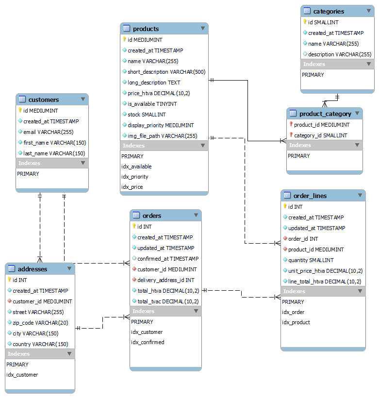

# Projet DWA EPHEC 

## Installation (LAMP)

### Configurer le server MySQL

Le répertoire `database` contient le schéma de la base de données (MySQL >= 5), ainsi qu'un jeu de données d'exemple.

### Configurer le server web

 - Le `DocumentRoot` du projet est le répertoire `public`.
 - Les ressources statiques cachables se trouvent dans le répertoire `public/resources`. 

### Définir les paramètres d'environnement

Définir localement le fichier non-versionné `env.php` avec les constantes suivantes:

```php
<?php

define('DB_NAME', 'dwa');
define('DB_HOST', 'localhost');
define('DB_CHARSET', 'utf8mb4');
define('DB_USER', 'root');
define('DB_PWD', '');
```

## Changements

 - [Sprint 0: Modélisation de la base de données](docs/sprint-0.md)
 - [Sprint 1: Pages produits statiques](docs/sprint-1.md)
 - [Sprint 2: Pages produits dynamiques](docs/sprint-2.md)
 - [Sprint 3: Filtres des produits](docs/sprint-3.md)

## Schéma des données


